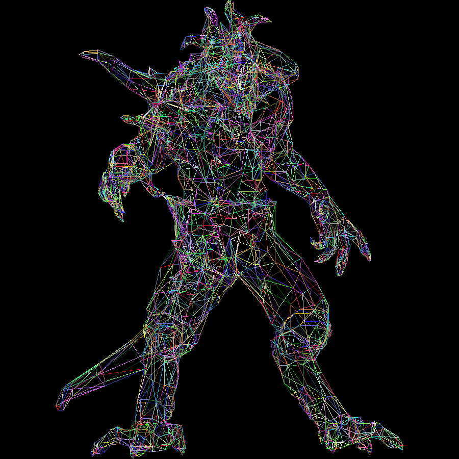
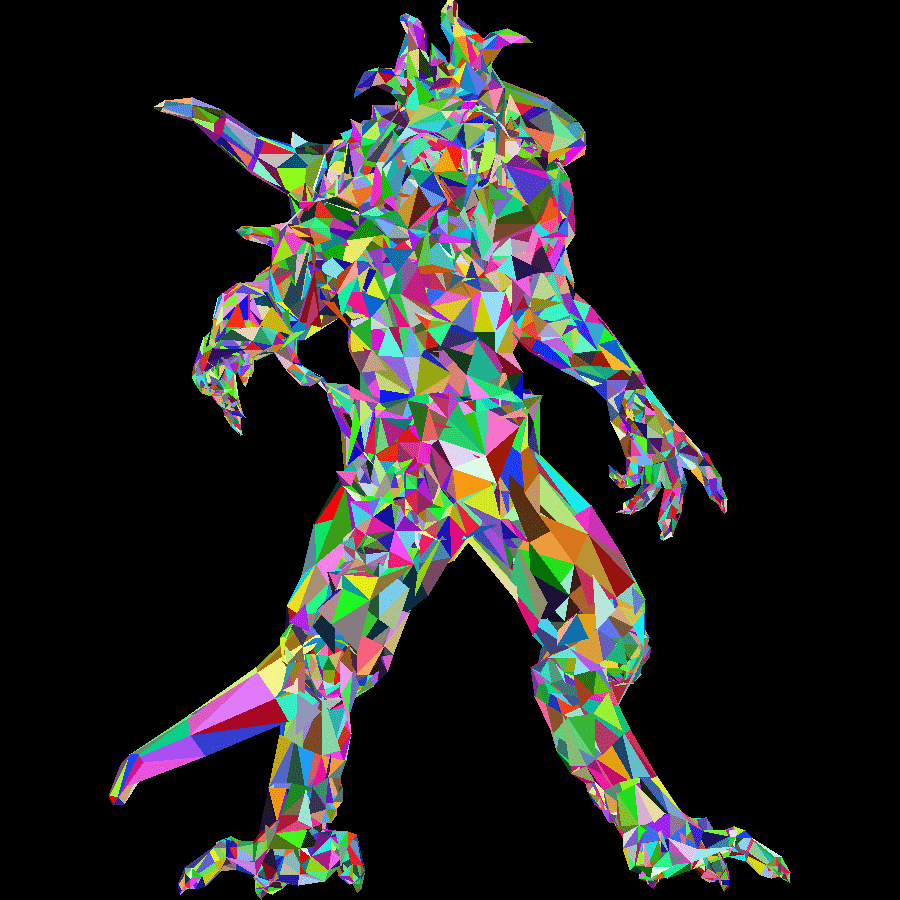
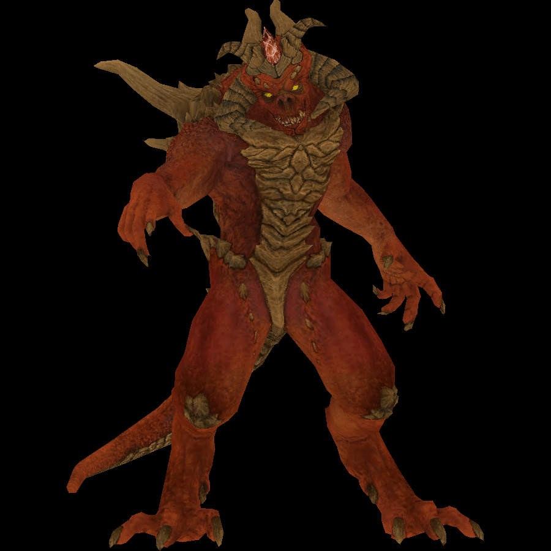

My attempt to write a simple software rasterizer.  

The two main sources consulted were the[tinyrenderer project](https://github.com/ssloy/tinyrenderer) and the [Computer Graphics from Scratch book](https://www.gabrielgambetta.com/computer-graphics-from-scratch/)  

To run, download, run `make all` then run `./main` on a linux machine.  

Display of images produced from the diablo.obj model found in the obj folder:  

